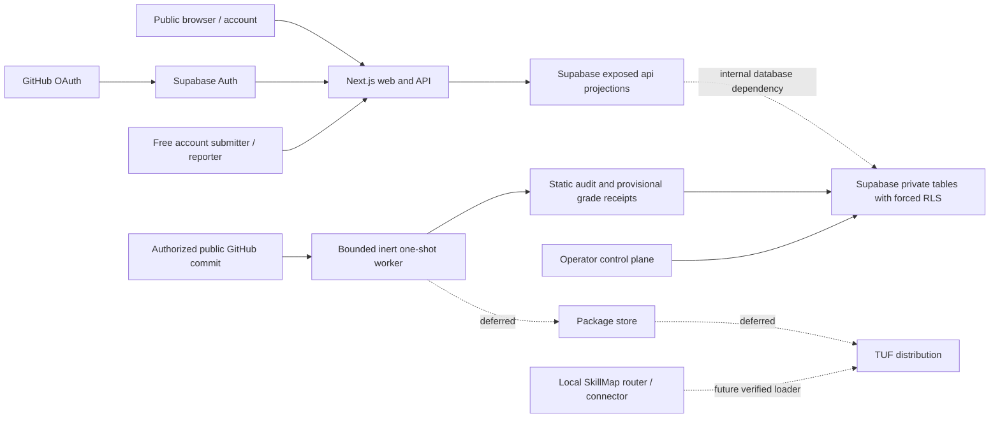

# Hosted Registry Architecture

Status: local free-public-alpha architecture. The Supabase-backed catalog/account/submission spine, constrained static-audit and provisional-grade worker, operator publication/report/lifecycle authority, and bounded current-version evidence projections are implemented and locally validated. Package mirroring/loading, TUF distribution, current-letter behavioral grading, advanced hosted routing, remote worker scheduling, and production deployment remain deferred or externally gated.

## System boundary

The local runtime remains a separate privacy and trust plane. Routine prompts and local skill bodies do not enter the hosted database. Hosted sessions do not authorize local connector actions.

## Truth owners

| Concern | Authority |
| --- | --- |
| Portable local inventory, policy, router, route history | Existing local CLI/connector immutable workspace revisions |
| Hosted public payload shape | Checked-in JSON Schemas and generated root/web validators |
| Hosted identity, lifecycle, relationships, account ownership | Supabase migrations and receipt-backed private tables |
| Public catalog projection | Explicit `api` schema security-invoker/barrier views |
| Launch source bytes | Immutable public GitHub coordinate plus bounded private evaluation evidence; no public package mirror |
| Package/update trust | Deferred SkillMap TUF profile and local verifying loader; not launch authority |
| Audit, compatibility, grade, advisory | Separate signed version/digest-bound receipts |
| Billing | None at launch; no entitlement or Stripe dependency exists |

## Data access matrix

| Surface | Anonymous | Account owner | Publisher member | Worker | Operator |
| --- | --- | --- | --- | --- | --- |
| Published non-revoked catalog projections | read | read | read | read | read |
| Private profile and saved skills | none | own rows | own rows | bounded support only | audited support only |
| Exact-commit submission and report intents | none | own rows only | deferred role surface | bounded queue processing | audited review/disposition |
| Static audit/provisional grade/publication evidence | public bounded current-version projection | own submission status only | deferred role surface | receipt-bound write | audited accept/reject/publish |
| Grade/lifecycle/revocation mutation | none | none | request/appeal later phase | no current-letter authority | consequential service-only action |

The browser exposes anonymous catalog/evidence reads and owner-isolated profile, save, submission, report, export, and deletion actions. It cannot mint audit/grade receipts or mutate review, publication, report disposition, or lifecycle state; those remain service-only authority.

## Request and data flows

### Anonymous catalog

1. Next.js parses a bounded query/cursor.
2. A server-only Supabase client selects the explicit `api` projection.
3. Forced RLS and parent lifecycle predicates exclude drafts, quarantines, revocations, and hidden parents.
4. The repository maps database rows into shared hosted contracts.
5. API and server-rendered UI return `no-store` truthful evidence states.

### Account save

1. Supabase Auth establishes a server-verified user; `getSession()` is never authorization authority.
2. The action validates immutable hosted skill ID and same-origin form context.
3. RLS allows only the user's profile/save mutation.
4. Saved projections join current public catalog state so revoked content disappears while owner cleanup remains possible.

### Current metadata-only submission and publication

1. A free account submission identifies an authorized public GitHub repository, immutable commit, and safe relative `SKILL.md` path.
2. A bounded one-shot worker claims the row, fetches exact inert bytes without executing content, normalizes and hashes evidence, and emits a static-audit plus letterless provisional-grade receipt.
3. An operator reviews license and public metadata, then accepts, requests changes, rejects, or publishes through service-only transactional RPCs.
4. Public projections expose only the current published, non-revoked metadata and bounded audit/grade evidence. Reports and lifecycle actions preserve append-only consequential receipts.
5. A changed commit creates another immutable version. Package mirroring/loading, TUF publication, and current-letter grading remain separate future programs.

## Environments and deployment gates

- Local: checked-in Supabase migrations/seed plus local Next.js; synthetic users only.
- Preview: isolated Supabase project/data, no production OAuth secrets, no publisher or operator mutation.
- Staging: production-like keys/roles, invited users, tested rollback/restore, signing and worker dry runs.
- Production: separate database and owner-approved zero-cost-compatible web projects, least-privilege secrets, verified custom domain/OAuth callbacks, encrypted off-host restore, monitoring, incident ownership, and a recorded zero-paid-cost boundary.

Provisioning any remote database, web host, artifact, or signing service is an external mutation and remains owner-approved. This launch does not authorize any paid provider resource. The free product contains no Stripe, checkout, subscription, entitlement, metering, or payment webhook path.

## Failure posture

Missing configuration or backend unavailability renders an explicit unavailable state; hosted routes never fall back to local fixtures. Public errors are bounded and redact secrets/paths. Consequential state changes are append-only/audited, workers are idempotent and retry-safe, an expired fifth claim has a receipt-backed terminal recovery path, copied-source collisions require an immutable current disposition before publication, lifecycle and revocation fail closed, and clients preserve a bounded last-known-good mode only as specified by the TUF profile.

The hosted Next.js surface requires JavaScript because its request-time streamed server components otherwise remain behind the loading shell. A visible `<noscript>` boundary states that limitation; authenticated controls are never presented as usable in that state. This does not affect the independent local CLI.
