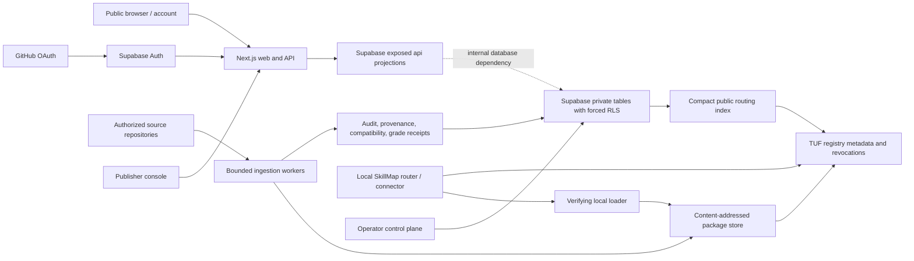

# Hosted Registry Architecture

Status: Phase 0 architecture baseline. Phase 1 implements the Supabase-backed public catalog and free-account spine locally. Package, TUF, worker, grader, hosted router, publisher/operator, and production deployment components remain gated by later phases.

## System boundary

The local runtime remains a separate privacy and trust plane. Routine prompts and local skill bodies do not enter the hosted database. Hosted sessions do not authorize local connector actions.

## Truth owners

| Concern | Authority |
| --- | --- |
| Portable local inventory, policy, router, route history | Existing local CLI/connector immutable workspace revisions |
| Hosted public payload shape | Checked-in JSON Schemas and generated root/web validators |
| Hosted identity, lifecycle, relationships, account ownership | Supabase migrations and receipt-backed private tables |
| Public catalog projection | Explicit `api` schema security-invoker/barrier views |
| Source/package bytes | Immutable provider coordinate plus content-addressed artifact store |
| Package/update trust | SkillMap TUF profile and local verifying loader |
| Audit, compatibility, grade, advisory | Separate signed version/digest-bound receipts |
| Billing | None at launch; no entitlement or Stripe dependency exists |

## Data access matrix

| Surface | Anonymous | Account owner | Publisher member | Worker | Operator |
| --- | --- | --- | --- | --- | --- |
| Published non-revoked catalog projections | read | read | read | read | read |
| Private profile and saved skills | none | own rows | own rows | bounded support only | audited support only |
| Publisher drafts/membership | none | none | role-scoped later phase | service task | audited control |
| Source/package/evidence mutation | none | none | submission intent later phase | receipt-bound write | audited override |
| Grade/lifecycle/revocation mutation | none | none | request/appeal later phase | policy-bound write | consequential audited action |

Phase 1 exposes only anonymous catalog reads and owner-isolated profile/save writes. Publisher/worker/operator mutation is intentionally absent from the application surface.

## Request and data flows

### Anonymous catalog

1. Next.js parses a bounded query/cursor.
2. A server-only Supabase client selects the explicit `api` projection.
3. Forced RLS and parent lifecycle predicates exclude drafts, quarantines, revocations, and hidden parents.
4. The repository maps database rows into shared hosted contracts.
5. API and server-rendered UI return `no-store` truthful evidence states.

### Account save

1. Supabase Auth establishes a server-verified user; `getSession()` is never authorization authority.
2. The action validates immutable hosted skill ID and same-origin form context.
3. RLS allows only the user's profile/save mutation.
4. Saved projections join current public catalog state so revoked content disappears while owner cleanup remains possible.

### Future ingestion and publication

1. A submission identifies an authorized source and immutable commit.
2. A bounded worker snapshots without executing skill content, determines license mode, and creates canonical package/evidence subjects.
3. Independent workers emit provenance, audit, compatibility, advisory, and grade receipts.
4. Policy promotes only fully bound states and emits an audit event.
5. Artifact/index/revocation publication occurs through TUF roles, not direct application writes.

## Environments and deployment gates

- Local: checked-in Supabase migrations/seed plus local Next.js; synthetic users only.
- Preview: isolated Supabase project/data, no production OAuth secrets, no publisher or operator mutation.
- Staging: production-like keys/roles, invited users, tested rollback/restore, signing and worker dry runs.
- Production: separate Supabase/Vercel projects, least-privilege secrets, verified custom domain/OAuth callbacks, backups/PITR, monitoring, incident ownership, and explicit cost approval.

Provisioning any remote Supabase, Vercel, artifact, signing, or paid service is an external mutation and remains owner-approved. The free product launch contains no Stripe, checkout, subscription, entitlement, metering, or payment webhook path.

## Failure posture

Missing configuration or backend unavailability renders an explicit unavailable state; hosted routes never fall back to local fixtures. Public errors are bounded and redact secrets/paths. Consequential state changes are append-only/audited, workers are idempotent and retry-safe, lifecycle and revocation fail closed, and clients preserve a bounded last-known-good mode only as specified by the TUF profile.
