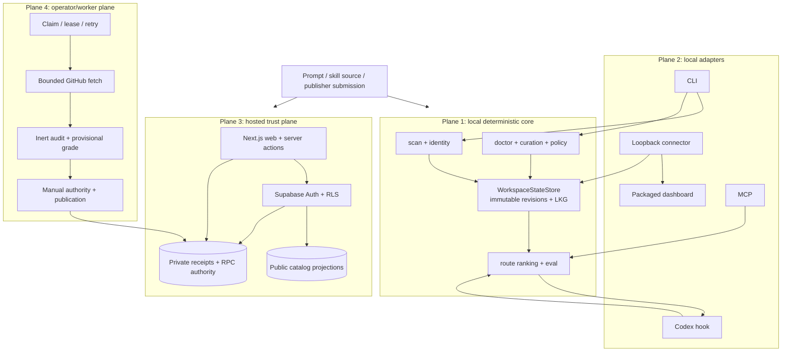
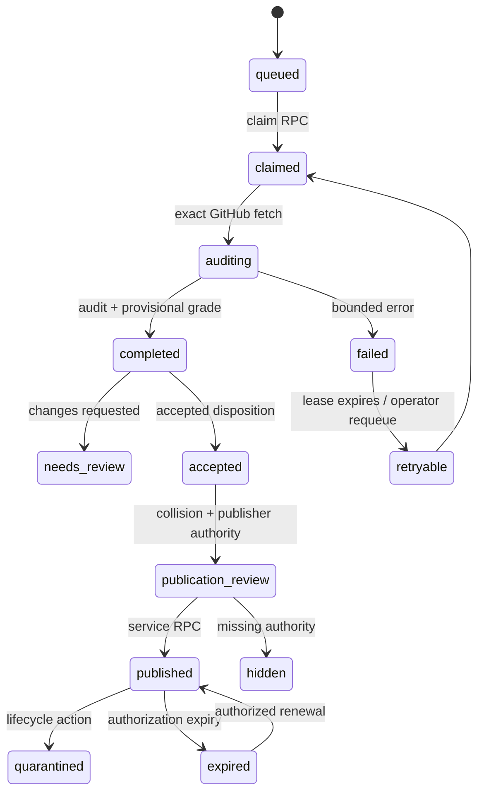

# SkillMap engineering audit

Reviewed: 2026-07-20  
Branch: `codex/hosted-library-foundation`  
CodeGraph: 316 files, 6,781 nodes, 24,038 edges, fresh

## Verdict

`fix required` before calling the platform production-ready.

The local core is coherent and strongly tested. The hosted alpha has serious engineering controls in place, but the platform still has operational and scale assumptions that are explicitly safe for a private alpha and unsafe to leave implicit for public production.

## Engineering topology

## Confirmed findings and launch risks

### P1 — Public rate limiting is only per process

Evidence: [`apps/web/lib/security/rate-limit.ts:30-37`](../../apps/web/lib/security/rate-limit.ts:30) explicitly implements an in-memory, per-process limiter, and the source comments say it is not a globally consistent public-release quota.

Impact: multiple serverless instances, regions, or restarts can each admit the full request budget. An attacker can bypass the intended 60 requests/minute catalog protection by spreading requests across instances. This is acceptable only as private-alpha defense-in-depth.

Required fix: add a provider/shared limiter before public release, or make the hosted deployment contract enforce one. Keep this local limiter as a fallback, but do not represent it as the production quota.

### P2 — Integration test suite has a reproducible contention timeout

Evidence: `npm run test:integration` produced 112 passes and one cancelled test: `recovery processes every anchored nonterminal job beyond the first 100` timed out at 30 seconds. The same test passed alone in 10.2 seconds.

Impact: CI can fail or become non-deterministic under suite load even when the behavior is correct. This weakens the release signal around the job ledger and recovery path—the area most likely to matter during an interrupted worker/dashboard process.

Required fix: remove the suite contention, reduce fixture cost, or give this test an explicit bounded timeout with controlled concurrency. The release lane should pass as one deterministic command, not only as isolated tests.

### P2 — Sitemap silently stops at 1,000 catalog skills

Evidence: [`apps/web/app/sitemap.ts:19-20`](../../apps/web/app/sitemap.ts:19) sets 50 items per page and 20 maximum pages. The function returns only the first 1,000 skills plus static pages.

Impact: once the catalog grows beyond 1,000 public skills, later detail/audit/grade pages are omitted from the sitemap without an alert or degraded-state marker. The catalog still works, but discoverability becomes incomplete.

Required fix: split the sitemap into indexed sitemap files, generate sitemap indexes, or make the bound an explicit monitored product limit.

### P2 — Worker depends on root build artifacts but its package does not build them

Evidence: [`apps/worker/src/process-once.mjs:5-13`](../../apps/worker/src/process-once.mjs:5) imports `../../../dist/...`, while `apps/worker/package.json` exposes worker commands without a worker-local build/preflight step.

Impact: a separately deployed or manually invoked worker can run against missing or stale `dist` output. The root README usually invokes worker commands through root scripts, but the worker package itself does not make that dependency impossible to violate.

Required fix: define one deployment artifact that bundles the root build and worker, or add a worker preflight that checks exact source/build version and refuses stale/missing dist with a clear error.

### P2 — Production metadata configuration is environment-dependent

Evidence: the successful Next.js production build emitted a `metadataBase` warning when `NEXT_PUBLIC_SITE_URL` was absent. [`apps/web/app/layout.tsx:21-24`](../../apps/web/app/layout.tsx:21) permits `metadataBase` to be undefined.

Impact: Open Graph/Twitter image and canonical URL generation can fall back to localhost or environment-dependent behavior. This is not an auth bug, but it creates incorrect share/index metadata if deployment configuration is incomplete.

Required fix: make the production build/deploy preflight require a valid site URL for hosted stages and keep localhost fallback limited to local candidate mode.

### P2 — Two very large modules concentrate unrelated failure domains

Evidence: `src/server/skillmap-backend.ts` is 2,721 lines and combines workspace selection, onboarding, routing, policy review, jobs, source checks, eval, activity, and API projection. `src/contracts/validate.ts` is 1,667 lines and combines many contract validators and release semantics.

Impact: changes have a wide blast radius and are harder to review. CodeGraph shows `executeRouteUseCase` reaches CLI, hook, MCP, dashboard backend, connector, and tests; this is a healthy shared boundary, but the surrounding backend is still too broad for safe ownership.

Required fix: split by use-case boundary behind the existing interfaces: workspace/onboarding, routing, jobs, policy review, source/eval, and projections. Do this incrementally with unchanged contracts and focused tests.

## Areas that look risky but are intentionally guarded

- Hosted server actions validate auth through verified claims and use RLS-scoped tables; the proxy protects `/account`, while submit/report/delete actions independently authenticate before writes.
- Worker mutations require `--execute`, use an allowlisted RPC client, bound request/response sizes, and preserve lease recovery when failure completion itself fails.
- Public catalog reads are intentionally anonymous; this is paired with projection views and RLS rather than treating the browser as an operator.
- Local routing reads an approved revision and can serve an explicitly recorded last-known-good revision; it does not silently route from arbitrary current files.
- Source ingestion is bounded and inert; repository scripts are not executed.

These are positive controls verified in source and local tests. They are not proof of a deployed service.

## CodeGraph-backed critical paths

### Local route blast radius

Changing `executeRouteUseCase` affects:

- `src/commands/route.ts`
- `src/commands/hook.ts`
- `src/commands/mcp.ts`
- `src/server/skillmap-backend.ts`
- `src/server/local-connector.ts`
- `src/cli.ts`
- route contract and core tests

That is the platform’s highest-value shared runtime seam. Any routing change needs contract, CLI, hook, MCP, dashboard, and eval verification together.

### Hosted submission failure path

The major operational unknown is not the state model; it is whether the deployed scheduler, alerts, lease recovery, and database backups actually exercise it.

## Validation evidence

- Root typecheck: passed.
- Web typecheck: passed.
- Root regression suite: 396 passed.
- Contract tests: 34 passed.
- Hosted web boundary tests: 31 passed.
- Local browser fixture tests: 9 passed.
- Web lint: passed.
- Next production build: passed with the metadata-base warning above.
- Integration suite: 112 passed, one 30-second timeout; isolated timeout case passed in 10.2 seconds.

Not verified: remote deployment, live OAuth, hosted database state, global rate limits, scheduled worker, production logs/alerts, backup restore, rollback, public indexing, or external pilot behavior.

## Recommended engineering sequence

1. Fix the integration timeout and make the full validation command deterministic.
2. Add deployment preflights for `NEXT_PUBLIC_SITE_URL`, root `dist`/worker version parity, provider rate limiting, and migration head.
3. Split the large backend by use-case boundary without changing public contracts.
4. Run the hosted gates against a disposable full Supabase + production Next.js stack.
5. Rehearse worker failure, lease expiry, requeue, publication, expiry, revocation, backup restore, and rollback.
6. Only then decide whether the platform is ready for a private pilot or public alpha.
