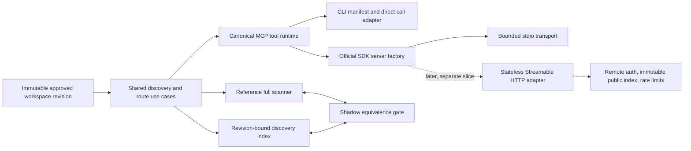

# SkillMap MCP Transport And Discovery Foundation Implementation Plan

> Status update (2026-07-16): implemented on exact candidate
> `fee340a2e4a86e13421696355fe9480e68285090` and published in draft GitHub
> PR `#21`. The candidate passed its local exact-candidate gates but remains
> unmerged and unreleased; GitHub-hosted jobs were allowance-blocked before
> execution. The original planning metadata below is retained as dated evidence.

## Planner Metadata

- Repository/path: `/home/codex/projects/skillmap`
- Canonical implementation base: `origin/main` commit `0eb57ac7c3aeda0c907435210a748a5ffb3a259e`, tree `2ca58122c830e81dcfe492f583e48c9cd06f2d3c`
- Inspection checkout: `codex/hosted-library-foundation` at `98c0e6775e52c9a6cf4c1c59c812c1569419104c`, tree `029b18135ffb5ad0d23cd4fe58a3515997781532`
- Inspection checkout state: dirty and user-owned; `21` commits ahead and `15` commits behind `origin/main` at planning time
- Required implementation branch: a new clean worktree and `codex/mcp-transport-discovery-foundation` branch created from the exact canonical implementation base
- Date: 2026-07-15
- Planning mode: full `planning-orchestrator` run with a parent-owned `/goal`
- Implementation status: not started
- Provider/account mutation status: no deployment, database, DNS, OAuth, Cloudflare, Vercel, Supabase, CI, or billing state changed
- Worker scopes:
  - protocol/domain architecture, official SDK migration, compatibility, and cutover;
  - remote auth/platform boundary and fail-closed prerequisites;
  - protocol, privacy, scale, performance, promotion, and rollback evidence.
- Visible thread decision: none; all workers were bounded research lanes inside this planning task
- Parent plan: `docs/plans/2026-07-15-skillmap-private-production-rehearsal-implementation-plan.md`
- External comparison: `oomol-lab/open-connector` pinned at `aa66320bf2c245cb33284ff160689780eb26e02a`; comparison findings are planning inputs, not SkillMap acceptance evidence

### Repository References Inspected

- `README.md`
- `package.json`, `package-lock.json`, `tsconfig.json`
- `src/cli.ts`
- `src/commands/mcp.ts`
- `src/contracts/route-ranking.ts`
- `src/core/api-envelope.ts`
- `src/core/route.ts`
- `src/core/route-events.ts`
- `src/core/redacted-metadata.ts`
- `src/services/route-use-case.ts`
- `src/services/workspace-read-model.ts`
- `src/server/compatibility.ts`
- `src/server/local-connector.ts`
- `src/server/skillmap-backend.ts`
- `apps/web/lib/registry/repository.server.ts`
- `apps/web/lib/registry/query.ts`
- `docs/architecture.md`
- `docs/decisions/2026-07-11-hosted-architecture.md`
- `docs/security.md`
- `docs/security/hosted-threat-model.md`
- `docs/commands.md`
- `docs/dogfood.md`
- `docs/personal-v1-runbook.md`
- `docs/host-compatibility.md`
- `test/core.mjs`
- `test/phase1-route-ranking.mjs`
- `test/phase2-local-connector.mjs`
- `test/phase3-local-app-modules.mjs`
- `test/slice-b-policy.mjs`
- root, hosted, package-candidate, Gitea, and GitHub validation scripts

### Current Primary Sources

- MCP TypeScript SDK v1 branch: https://github.com/modelcontextprotocol/typescript-sdk/tree/v1.x
- MCP TypeScript SDK v1 server guide: https://github.com/modelcontextprotocol/typescript-sdk/blob/v1.x/docs/server.md
- Published SDK package: https://www.npmjs.com/package/@modelcontextprotocol/sdk
- MCP lifecycle: https://modelcontextprotocol.io/specification/2025-06-18/basic/lifecycle
- MCP tools: https://modelcontextprotocol.io/specification/2025-06-18/server/tools
- MCP transports: https://modelcontextprotocol.io/specification/2025-06-18/basic/transports
- MCP authorization: https://modelcontextprotocol.io/specification/2025-11-25/basic/authorization
- Cloudflare remote MCP guide: https://developers.cloudflare.com/agents/model-context-protocol/guides/remote-mcp-server/
- Cloudflare Workers limits: https://developers.cloudflare.com/workers/platform/limits/
- Supabase OAuth server: https://supabase.com/docs/guides/auth/oauth-server
- Supabase MCP authentication: https://supabase.com/docs/guides/auth/oauth-server/mcp-authentication
- Current Supabase resource-indicator gap: https://github.com/supabase/auth/issues/2610
- Pinned Open Connector source: https://github.com/oomol-lab/open-connector/tree/aa66320bf2c245cb33284ff160689780eb26e02a

### Research Constraints And Assumptions

- Context7 was invoked first for the current MCP SDK as required, but its monthly quota was exhausted. Official source, published-package contents, live npm metadata, and primary platform documentation were used as the fallback.
- Live npm metadata on 2026-07-15 reports stable `@modelcontextprotocol/sdk@1.29.0`, `zod@4.4.3`, and split v2 packages at `2.0.0-beta.4`. The stable v1 package is the implementation choice for this slice.
- The published `@modelcontextprotocol/sdk@1.29.0` `StdioServerTransport` does not expose the later v1-branch `maxBufferSize` option. A bounded input wrapper is therefore required to preserve SkillMap's 64 KiB framing limit.
- The current six local tool names are compatibility surface. This slice does not rename, alias, add, or remove tools.
- The local approved revision remains the authority. No hosted row, fixture, remote index, or Open Connector structure may displace it.
- Historical Open Connector benchmark numbers and prior SkillMap checkpoint results may guide design, but fresh candidate-owned evidence is required for acceptance.
- Rust is not an assumed solution. TypeScript remains the default until a profile proves an algorithmic and runtime bottleneck after the index work is complete.

## Executive Goal

Turn SkillMap's existing local MCP command into a standards-compliant, bounded, transport-neutral discovery server without weakening local privacy, approved-revision authority, deterministic routing, packaging, or current client compatibility.

At the end of this slice:

- an official MCP SDK client can initialize, receive server instructions, list, and call all six existing tools through the real spawned stdio process;
- `serverInfo.version` is a string and lifecycle notifications are handled by the official SDK;
- every tool has a frozen input schema, output schema, annotations, structured content, compatible text fallback, and safe error behavior;
- `mcp manifest`, `mcp call`, `mcp serve`, the local connector integration view, CLI routing, hook routing, and API routing continue to use the same approved-revision semantics;
- search and detail selection share one domain service while retaining explicit surface-specific redaction;
- a revision-bound discovery index can accelerate warm routing/search without changing a single canonical recommendation, exclusion, decision digest, result ordering, or cursor boundary;
- fresh conformance, parity, privacy, 500/5,000/25,000-skill profile, consumer-install, and package receipts exist for the exact candidate;
- the resulting server factory is ready for a later stateless Streamable HTTP adapter, but no remote endpoint, auth provider, content loader, or deployment is created in this slice.

This is the foundation for the remote MCP, not a claim that the remote MCP or public product is ready.

## Source Of Truth Contract

- Intent: repair and harden the local MCP transport and discovery core first so later remote work reuses proven semantics instead of rebuilding them at the edge.
- Current behavior: `src/commands/mcp.ts` contains a hand-written newline JSON-RPC loop, six tools, validation, pagination, redaction, domain access, and framing. It emits numeric `serverInfo.version: 2`, fixes protocol version `2024-11-05`, mishandles `notifications/initialized`, returns only text content, maps expected domain failures to protocol errors, and has no official-client conformance test.
- Expected outcome: the official stable SDK owns MCP lifecycle and tool registration; SkillMap owns bounded framing, domain handlers, redaction, approved revisions, deterministic results, safe envelopes, route-event policy, and evidence.
- Truth owner:
  - protocol behavior: exact pinned SDK version plus official-client target traces;
  - local discovery/routing: checked-in use cases and the immutable approved workspace revision;
  - compatibility: frozen tool contract fixtures and existing CLI/local connector contract tests;
  - optimization correctness: the existing `rankRoutePrompt` full scanner as the oracle;
  - acceptance: exact commit/tree/tarball plus run-bound machine-readable receipts.
- Contract boundary:
  - `src/services/**` owns approved-state discovery and deterministic domain results;
  - `src/mcp/**` owns tool schemas, handler composition, SDK server construction, result conversion, and transports;
  - `src/commands/mcp.ts` owns CLI compatibility only;
  - `src/server/skillmap-backend.ts` owns the richer local HTTP/dashboard projection and reuses shared discovery semantics without leaking those richer fields to MCP;
  - future `apps/mcp/**` owns remote HTTP/auth/rate/edge concerns and may depend only on protocol-neutral contracts and published hosted metadata, never local workspace state.
- Displaced path:
  - the hand-written MCP lifecycle and request dispatcher are deleted after the SDK cutover;
  - duplicated search normalization/sort/cursor logic is replaced by one discovery service;
  - invalid raw JSON-RPC examples in docs are replaced by an official-client smoke or a valid initialize -> initialized -> list/call sequence;
  - no permanent `--legacy` transport remains.
- Cutover:
  1. Create a clean worktree from the exact canonical base and reproduce the official-client failure.
  2. Freeze current CLI/tool/result behavior with golden tests.
  3. Extract shared discovery semantics with no surface output regression.
  4. Add the official SDK server and in-process tests.
  5. Switch `mcp serve` only after a spawned `StdioClientTransport` test passes.
  6. Add the revision-bound index behind `reference`, `shadow`, and `indexed` strategies; promote `indexed` only after zero semantic mismatches.
  7. Run exact-candidate package and consumer validation before removing the old dispatcher.
- Acceptance evidence:
  - official SDK client trace through the real child process and packed consumer install;
  - tool-list golden payload and server instructions;
  - all-six-tool structured/text result equivalence;
  - CLI/hook/MCP/API route decision and decision-digest parity;
  - search ordered-ID/cursor parity across MCP and local API while preserving surface redaction;
  - 64 KiB input and 512 KiB response boundary evidence;
  - privacy canary receipt;
  - deterministic index and reference-scanner equivalence receipts at 500, 5,000, and 25,000 skills;
  - package, dependency, startup, and rollback receipts.
- Evidence lane: write redacted run artifacts beneath `.skillmap/reports/mcp-foundation/<run-id>/`; retain only counts, digests, seeds, commands, versions, aggregate timings, and pass/fail outcomes. Never retain raw prompts, skill bodies, paths, tokens, emails, cookies, or canary values.
- Kill criteria:
  - any official client cannot initialize/list/call/close reliably;
  - any tool name, input boundary, result envelope, approved revision, recommendation, exclusion, decision digest, or current CLI behavior drifts without an explicitly accepted contract amendment;
  - prompt, path, secret, or private metadata appears in MCP output, stderr, logs, fixtures, or receipts;
  - an oversized frame or result bypasses the current safety limits;
  - an index mismatch is ignored, truncated, or silently approximated;
  - the SDK dependency breaks consumer install, supported Node versions, package policy, or production vulnerability gates;
  - implementation starts remote HTTP/auth/content/deployment work before this slice is accepted.
- Forbidden moves:
  - do not edit or clean the dirty inspection checkout beyond this plan artifact;
  - do not implement from the moving branch name without binding the exact base commit/tree;
  - do not copy Open Connector source code; adapt patterns cleanly and use direct upstream dependencies;
  - do not add execution, install, write, audit, grade, account, or operator tools;
  - do not add `recommend_skills`, `get_skill_metadata`, `load_skill`, aliases, or one-tool-per-skill registration;
  - do not expose skill bodies, raw descriptions containing private metadata, workspace paths, prompts, or route history through MCP;
  - do not add Supabase, Cloudflare, Vercel, HTTP, OAuth, RLS, KV, R2, D1, Durable Objects, TUF, or deployment code in this slice;
  - do not make route correctness depend on network access, an LLM, embeddings, or Rust;
  - do not claim remote latency, Workers Free fit, product efficacy, deployment, or live verification from local tests.

## Native Planning Superiority

- Codex Native baseline: a generic plan would say to install the MCP SDK, refactor the server, and add tests.
- What this planning run does better:
  - binds a clean canonical commit/tree while preserving a divergent dirty checkout;
  - proves the exact protocol failures and current compatibility surfaces;
  - selects the stable v1 SDK from live package state instead of the current v2 beta;
  - preserves explicit byte limits that the published SDK does not enforce;
  - separates domain, transport, CLI, local HTTP, and future edge authority;
  - turns the Open Connector comparison into adopt/adapt/avoid decisions without importing its code or weaknesses;
  - defines reference-vs-index semantic equivalence, quantitative profiles, privacy canaries, rollback, and target-perspective evidence;
  - distinguishes what this local slice can prove from what only a real HTTP route, OAuth flow, Worker trace, or deployment can prove.
- User-specific context used: local-first privacy, no billing, eventual free public skill hub, 5,000-skill/1,000-user scaling questions, latency sensitivity, Supabase/Vercel/Cloudflare exploration, Open Connector comparison, protected dual-remote release practice, and preference for exact operational receipts.
- Superiority score target: `5/5`.
- Proof artifacts: this durable plan, three worker receipts, exact repository anchors, pinned official sources, package metadata/integrity inspection, file-level backlog, target evidence ladder, and implementation-orchestrator handoff.

## Orchestration Decision

- Mode: full worker run.
- Worker count: three focused planning workers plus the parent synthesis.
- Decision reason: the request crosses protocol correctness, domain architecture, compatibility, remote trust, performance, validation, and release evidence.
- Independent surfaces:
  - local MCP lifecycle and discovery architecture;
  - future remote auth/tenant/platform boundary;
  - conformance, privacy, scale, performance, promotion, and rollback.
- Workers used:
  - protocol/domain worker: accepted local SDK-first cutover, six-name compatibility, transport-neutral factory, structured outputs, and clean-room Open Connector adaptation;
  - auth/platform worker: established that direct Supabase access tokens must not be accepted by a future `/mcp` resource server and identified remote membership/index prerequisites;
  - validation worker: established the evidence ladder, exact semantic oracle, profile matrix, privacy gates, and prohibition on using local timing as Cloudflare proof.
- Thread decision: no user-visible threads; the lanes were bounded and parent-owned.
- Reconsider trigger: create a separate implementation plan/goal when work expands into `apps/mcp`, OAuth consent, pilot membership, edge publication, body loading, or provider deployment.

## Background Browser Lane

- Needed: no for this implementation slice.
- Target/surface: the acceptance target is a real spawned stdio process and installed package, not a browser-rendered surface.
- Safety boundary: do not edit the user's global Codex, Claude, Hermes, or MCP host configuration. Any host smoke must use an isolated temporary home/configuration.
- Required receipt: official SDK `StdioClientTransport` trace against `node dist/cli.js mcp serve`, followed by an exact packed-consumer trace. An in-memory handler test alone is insufficient.
- Stop condition: if the only way to test a target host would mutate the user's global configuration or require unapproved account access, stop that optional host lane and retain the official spawned-client receipt.
- Future browser trigger: the remote auth slice must browser-test the real OAuth login/consent/callback path on the final origins; this plan does not claim that proof.

## Research And Inspiration Findings

### Open Connector

Adopt:

- a fixed, small tool surface whose size does not grow with the catalog;
- progressive discovery rather than one tool per skill;
- an official SDK server and official SDK client tests;
- a transport-neutral composition root with injected runtime dependencies;
- server instructions that explain the recommended call sequence;
- structured content plus a compatible text fallback;
- metadata-hot and content-cold architecture;
- lazy deterministic candidate indexing and generated operator/agent guidance.

Adapt:

- use SkillMap's revision-bound `skillmap.api-response` envelopes instead of a generic `{ok,data}` wrapper;
- use `route_prompt -> search_skills -> show_skill` as the current progressive local path; do not add a guide tool merely to copy Open Connector;
- preserve approved revision, last-known-good, redaction, policy, qualified ID, exclusion, and cursor semantics;
- use a purpose-built postings index with the existing deterministic scanner as oracle instead of adopting MiniSearch by default;
- use prompt-free route-event observability and disclose it in instructions/annotations;
- add exact output schemas and safe structured errors.

Avoid:

- provider/action execution, credential brokering, generic connectors, and per-provider loaders;
- fail-open auth when token configuration is missing;
- O(number of tokens) verification and synchronous last-used writes on the hot path;
- N+1 provider/catalog reads and all-catalog responses;
- synchronous logging after an external side effect;
- global server/transport reuse;
- broad monolithic server classes;
- treating provider breadth as test coverage;
- copying Apache-2.0 code into the MIT repository without a deliberate attribution/NOTICE decision.

### Official MCP SDK And Specification

- Stable production choice for this slice: exact `@modelcontextprotocol/sdk@1.29.0` and `zod@4.4.3`, installed with saved exact versions and lockfile integrity.
- Do not use split `@modelcontextprotocol/server`, `client`, or `node` v2 packages while their live dist-tag is beta.
- `McpServer.registerTool` registers each tool definition, input/output schemas, annotations, and handler. The server/transport owns lifecycle negotiation and notifications; server construction owns instructions; each handler owns structured content and safe tool-error results.
- `StdioServerTransport` is the correct local transport, but the published 1.29.0 constructor lacks a configurable buffer limit. Feed it a tested bounded `Readable` adapter or implement a minimal SDK `Transport` wrapper; do not restore a parallel JSON-RPC dispatcher.
- Use the SDK's `InMemoryTransport` only for fast contract tests. The real acceptance lane must spawn the CLI with `StdioClientTransport`.
- Server version is `SKILLMAP_PRODUCT_VERSION` as a string. The existing local manifest's numeric `version: 2` remains a separate SkillMap compatibility contract.

### Cloudflare And Supabase Boundary

- Cloudflare currently documents stateless remote MCP through `createMcpHandler()` without Durable Objects. That is the likely later topology, not a deliverable here.
- Workers Free currently lists 10 ms CPU/request, 128 MB memory, and 3 MB compressed Worker size. Only an exact deployed Worker trace can prove those budgets; local Node and Wrangler numbers cannot.
- The future remote endpoint must use protected-resource discovery, resource/audience-bound tokens, fail-closed mode parsing, host checks, rate limits, and a fresh server/transport per request.
- As of planning, Supabase OAuth is suitable as an upstream identity provider but not as the bearer token accepted directly by the MCP resource server because resource indicators/custom MCP scopes are not available. Re-verify this against current primary docs before the auth slice.
- Future hosted tools must read an immutable public metadata index and revocation snapshot. They must never import the Next.js/Supabase repository module or use a service-role key on the interactive path.

### Performance And Language Decision

- The first optimization is architectural: normalize once, compile postings once per approved revision, bound candidate work, reuse warm state, and keep telemetry off the response path.
- TypeScript is adequate for this foundation. A Rust rewrite is forbidden until fresh profiles show that exact TypeScript algorithms cannot meet the frozen target after data-shape and caching work.
- Local 500/5,000/25,000 profiles are engineering evidence only. They establish algorithmic scaling and regression detection, not edge CPU or network latency.

## Current State

- Canonical `origin/main` and the inspection branch contain the same current MCP implementation, even though the broader branches have diverged.
- `src/commands/mcp.ts` is approximately 279 lines and combines transport, lifecycle, validation, schemas, pagination, redaction, domain calls, and errors.
- The current initialize response uses numeric `serverInfo.version: 2`; an official SDK client rejects it because the protocol requires a string.
- The current dispatcher returns a response to `notifications/initialized`, even though notifications have no response.
- The dispatcher accepts incomplete initialize parameters and pins one old protocol revision rather than negotiating through the SDK.
- Tool calls return JSON only as text and always set `isError: false` after a handler succeeds.
- The six tools are `route_prompt`, `search_skills`, `show_skill`, `show_skillgraph`, `doctor_summary`, and `source_status`.
- `route_prompt` already calls `executeRouteUseCase`, uses approved/current revision receipts, records a prompt-free route event, and shares deterministic semantics with CLI/hook/API routing.
- MCP and `SkillMapLocalBackend` duplicate skill search, sorting, redaction, detail, and cursor behavior; their searchable fields and output projections have already diverged.
- MCP search scans every skill and rebuilds searchable strings per call. Pagination hashes the complete result value set for each page.
- The core ranker scans every skill. It correctly handles names, tokens, aliases, preferred/avoid terms, tiers, explicit-only policy, scripts, supersession, qualified IDs, stable ordering, and exclusions.
- Existing tests prove route and privacy parity through direct `mcp call`, but no test uses the official MCP client lifecycle.
- Existing docs include an invalid raw initialize transcript and some `show_skill --name` examples even though the implementation requires a qualified `--skill-id`.
- There is no official SDK dependency, `src/mcp` module, remote HTTP app, auth contract, compiled edge index, body loader, or deployed MCP endpoint.
- Hosted search is Supabase full-text search over published projections; it is not the local MCP source of truth and is not imported into this slice.
- Existing eval data can prove mechanics, not product efficacy. This slice does not make an efficacy claim.

## Future State



Product principles:

- one domain truth, multiple thin transports;
- stable small tool surface;
- metadata first, selected detail second, content only after a separate authority slice;
- approved revision and digest in every consequential result;
- redaction before transport conversion;
- exact deterministic results before speed;
- bounded input, output, concurrency, and cache state;
- local prompts stay local and are never returned or stored;
- scanner remains a correctness oracle, not a silent runtime fallback after remote launch;
- remote auth and content authority remain fail-closed, separate concerns.

### Frozen Local Tool Workflow

1. `route_prompt` for a task that needs recommendations.
2. `search_skills` when the agent needs to browse or refine by metadata.
3. `show_skill` only after selecting a qualified `skillId`.
4. `show_skillgraph`, `doctor_summary`, and `source_status` only for local diagnostics.

No tool returns a skill body, installs a skill, executes a script, changes policy, approves routing, claims an audit/grade, or contacts a network service.

## Non-Goals

- Remote `apps/mcp` package or `/mcp` HTTP route.
- Cloudflare, Vercel, Supabase, DNS, domain, OAuth, RLS, rate-limit, KV, R2, D1, Durable Object, or deployment changes.
- Pilot membership or website login-wall work.
- Public tool naming or remote tool exposure.
- `load_skill`, chunking, resource links, body mirroring, content redistribution, package authority, TUF, signature, revocation, or execution.
- New skill audit, grade, publisher, account, submission, or operator tools.
- Embeddings, vector search, LLM calls, fuzzy ranking, semantic model changes, or Rust.
- UI, marketing, billing, metering, subscriptions, or acquisition work.
- Public-launch, remote-latency, Workers Free, efficacy, or live-availability claims.
- Refactoring unrelated hosted worker, database, web, release, or local-app code.

## Phase Plan

### Phase 0 - Freeze The Candidate And Compatibility Contract

1. Fetch both remotes read-only and verify that the exact base commit/tree still exists.
2. Create a new clean worktree from `0eb57ac7c3aeda0c907435210a748a5ffb3a259e` and branch `codex/mcp-transport-discovery-foundation`.
3. If `origin/main` moved, compare MCP-relevant files against the pinned base. Stop and amend this plan if semantics changed; do not silently rebase the plan.
4. Record current tool names/order, manifest v2 projection, argument limits, result envelopes, cursor behavior, route parity, and privacy canaries as golden vectors.
5. Add a RED official-client regression that demonstrates the current numeric-version/lifecycle failure, then implement within the same branch; do not merge a red candidate.
6. Record exact npm versions, integrity values, license, engine support, and current v2 beta status.

Pass condition: exact clean base and compatibility fixtures exist; the dirty inspection checkout is unchanged.

### Phase 1 - Extract Shared Discovery Semantics

1. Add `src/services/skill-discovery-use-case.ts` to own:
   - approved workspace reads;
   - normalized query matching;
   - stable skill ordering;
   - revision/query/tool-bound pagination;
   - a minimal redacted base summary;
   - MCP-safe summary/detail projection;
   - local API additive projection hooks;
   - graph, doctor, and source-status read helpers where extraction remains narrow.
2. Keep `executeRouteUseCase` and `rankRoutePrompt` as the routing truth. Do not duplicate or translate routing logic in MCP.
3. Update `SkillMapLocalBackend.listSkills/showSkill` and MCP handlers to reuse the same ID selection, ordering, and cursor semantics while retaining explicit richer local-only fields.
4. Preserve current fail-closed approved-state, stale digest, canonical divergence, and last-known-good behavior.
5. Preserve current `mcp call` JSON output and local connector payload contracts.

Pass condition: ordered skill IDs, pagination boundaries, route decisions, and revision receipts match the frozen vectors; MCP does not gain richer local-only metadata.

### Phase 2 - Add The Official SDK Server And Bounded Stdio

1. Install exact runtime dependencies:

   ```bash
   npm install --save-exact @modelcontextprotocol/sdk@1.29.0 zod@4.4.3
   ```

2. Add a protocol-neutral MCP module:
   - `src/mcp/tool-schemas.ts`
   - `src/mcp/tool-runtime.ts`
   - `src/mcp/tool-registry.ts`
   - `src/mcp/results.ts`
   - `src/mcp/server.ts`
   - `src/mcp/transports/stdio.ts`
3. Make the server factory accept an injected runtime. It must contain no `cwd`, filesystem-path, Supabase, Next.js, Cloudflare, or process-global assumptions.
4. Register the exact six tools with titles, descriptions, Zod input/output schemas, and annotations.
5. Return the existing SkillMap API success envelope as both `structuredContent` and canonical compact JSON text. Enforce semantic equality between them.
6. Map expected domain failures to safe `isError: true` envelopes. Keep malformed protocol envelopes and unknown protocol methods as protocol errors.
7. Construct the server with the repository-owned build-time `SKILLMAP_PRODUCT_VERSION` string from `src/server/compatibility.ts`, synchronized with package metadata rather than read from the environment. Reject an empty or over-64-byte injected test override, and prove a clean packed consumer install receives the valid default. Add concise instructions describing workflow, metadata-only scope, approved revisions, last-known-good receipts, and the prompt-free route-event side effect.
8. Feed `StdioServerTransport` from a bounded line-aware `Readable` wrapper. A line above 64 KiB fails closed and closes the connection; no unbounded buffering or parallel JSON-RPC dispatcher remains.
9. Enforce a tool-result budget small enough that structured content plus text fallback and JSON-RPC framing remain under 512 KiB. Return `RESPONSE_TOO_LARGE` safely before writing an oversized frame.
10. Keep stdout protocol-only. Safe diagnostics may use stderr and must pass canary scanning.
11. Reduce `src/commands/mcp.ts` to:
    - a manifest projection derived from the canonical registry;
    - a direct handler call for `mcp call`;
    - SDK server plus bounded stdio for `mcp serve`.
12. Keep the current manifest's numeric `version: 2` and current local-app projection distinct from MCP `serverInfo.version`.

Pass condition: official in-memory and spawned stdio clients initialize, receive instructions, list, call, close, and reconnect; all current CLI/local connector contracts stay green.

### Phase 3 - Add Exact Revision-Bound Discovery Acceleration

1. Add `src/core/skill-discovery-index.ts` as a pure deterministic compiler and reader over the approved effective registry.
2. Index only normalized routing/discovery metadata needed by current semantics: skill ordinal/ID, names, aliases, descriptions, preferred/avoid phrases, family, tier, eligibility, explicit policy, scripts, and supersession relationships.
3. Bind the index to schema version, skill count, effective revision digest, and canonical index digest.
4. Use sorted postings and stable ordinals. Do not introduce fuzzy matching, embeddings, locale-dependent nondeterminism, unbounded candidate truncation, or MiniSearch unless a separate measured decision replaces this task.
5. Refactor the ranker so a candidate set can reduce scoring work while policy/exclusion and stable ordering semantics remain exact. The original full scan remains callable as the oracle.
6. Precompute the current exact substring-search haystack once per skill. Do not change current search match semantics in this slice.
7. Add a bounded runtime cache keyed by effective revision digest, maximum two revisions. A revision change cannot reuse stale index/cursor/request state.
8. Provide three explicit strategies for implementation and tests:
   - `reference`: full scanner only;
   - `shadow`: run reference and indexed paths, compare canonical semantics, return reference;
   - `indexed`: return indexed result after acceptance.
9. No candidate cap may silently reduce recall. Broad postings either remain exact or fail an explicit test/benchmark budget.
10. Promote `indexed` as the local stdio default only after every equivalence and privacy gate passes. Preserve a documented `reference` kill switch for rollback/debugging.

Pass condition: zero canonical semantic mismatches across golden, real eval mechanics, adversarial vectors, and seeded fuzz; warm local targets pass or the server remains on `reference` without a false performance claim.

### Phase 4 - Documentation, Packaging, Acceptance, And Rollback

1. Add focused tests and fixtures:
   - `test/mcp-contracts.mjs`
   - `test/mcp-protocol.mjs`
   - `test/mcp-discovery-index.mjs`
   - `test/fixtures/mcp/v3/**`
   - `scripts/benchmark-mcp-discovery.mjs`
2. Update existing route, core, connector, local-app module, and policy tests where they consume the frozen MCP contract.
3. Update:
   - `docs/commands.md`
   - `docs/dogfood.md`
   - `docs/personal-v1-runbook.md`
   - `docs/architecture.md`
   - `docs/host-compatibility.md`
   - `docs/security.md` or the local threat model if the bounded transport/error boundary changes.
4. Replace invalid raw JSON-RPC instructions and incorrect `show_skill --name` examples.
5. Run the exact packed tarball through the spawned official client, not only the source checkout.
6. Measure dependency/package/startup impact and run production dependency audit.
7. Generate redacted run-bound receipts and an index file beneath `.skillmap/reports/mcp-foundation/<run-id>/`.
8. Prove rollback by reverting the SDK cutover in a disposable worktree and rerunning the legacy smoke against unchanged workspace artifacts; do not retain a runtime legacy flag.
9. Run an independent engineering acceptance review before merge/candidate promotion.

Pass condition: all local slice acceptance criteria below are satisfied against one exact clean candidate; no remote/product claim is made.

### Follow-On Gate - Remote Streamable HTTP And Auth

This is not part of the implementation goal for this plan.

The next plan may begin only after Phase 4 is accepted and must separately freeze:

- remote tool names and public metadata contract;
- closed/invite-only/public-read access modes;
- pilot membership authority and revocation snapshot;
- OAuth protected-resource discovery, resource/audience binding, PKCE, client compatibility, and consent;
- immutable edge index publication and rollback;
- response/body authority, including the current 1 MiB local skill limit versus 512 KiB MCP response boundary;
- `load_skill` authorization, redistribution, digest, chunking/resource-link, TUF, and revocation semantics;
- real Worker bundle/CPU/memory/startup, geographic latency, concurrency, provider-log, and rollback evidence.

Direct Supabase bearer tokens must not be accepted by `/mcp` unless current primary documentation and target-client tests prove resource/audience binding. The likely boundary is a Cloudflare resource-token issuer with Supabase only as upstream identity, but that remains a separately reviewed decision.

## Task Backlog

| ID | Task | Primary files/surface | Depends on | Deliverable and pass condition |
| --- | --- | --- | --- | --- |
| PREP-001 | Create clean exact-base worktree and branch; record status/commit/tree/remotes | git/worktree | none | Exact `0eb57ac`/`2ca5812`; current dirty checkout untouched |
| PREP-002 | Freeze manifest, tools, schemas, limits, cursor, route, and privacy golden vectors | `test/fixtures/mcp/v3/**`, existing tests | PREP-001 | Current behavior captured before refactor |
| DEP-001 | Pin SDK and Zod with integrity/license/engine receipt | `package.json`, `package-lock.json` | PREP-001 | Exact `1.29.0` and `4.4.3`; no v2 beta; audit policy green |
| DISC-001 | Extract approved discovery selection/sort/cursor service | `src/services/skill-discovery-use-case.ts` | PREP-002 | Same ordered IDs, pages, revisions, and failure behavior |
| DISC-002 | Reuse shared discovery in local backend without collapsing redaction profiles | `src/server/skillmap-backend.ts` | DISC-001 | Local richer fields preserved; MCP gains nothing private |
| MCP-001 | Define exact tool input/output schemas and annotations | `src/mcp/tool-schemas.ts`, `tool-registry.ts` | DEP-001, PREP-002 | Six names/order only; frozen schemas; list payload <=16 KiB |
| MCP-002 | Build injected tool runtime over shared services | `src/mcp/tool-runtime.ts` | DISC-001, MCP-001 | No transport/process/provider assumptions |
| MCP-003 | Convert safe success/error envelopes to structured plus text results | `src/mcp/results.ts` | MCP-001 | Canonical equality; safe `isError`; total response <=512 KiB |
| MCP-004 | Build official SDK server factory and instructions | `src/mcp/server.ts`, `src/server/compatibility.ts` | MCP-002, MCP-003 | String server version; workflow/safety instructions; no global state |
| MCP-005 | Add bounded stdio adapter around official transport | `src/mcp/transports/stdio.ts` | MCP-004 | >64 KiB line fails closed; stdout protocol-only |
| MCP-006 | Reduce command to compatibility adapter | `src/commands/mcp.ts`, `src/cli.ts` if needed | MCP-004, MCP-005 | `manifest/call/serve` compatibility; old dispatcher removed |
| MCP-007 | Preserve prompt-free route-event semantics and disclose annotation behavior | runtime, docs, route-event tests | MCP-002 | No prompt stored/returned; event remains revision-bound |
| IDX-001 | Define deterministic index schema/digest and two-revision cache | `src/core/skill-discovery-index.ts` | DISC-001 | Same input -> same bytes/digest; stale revision cannot reuse |
| IDX-002 | Add exact candidate-assisted ranker with scanner oracle | `src/contracts/route-ranking.ts`, `src/core/route.ts` | IDX-001 | No semantic/output/order/exclusion drift |
| IDX-003 | Precompute exact search haystacks without changing substring semantics | discovery service/index | IDX-001 | Same matches/order/cursors at all profiles |
| IDX-004 | Add reference/shadow/indexed strategy and kill switch | route/discovery runtime | IDX-002, IDX-003 | Shadow returns reference; indexed enabled only after acceptance |
| TEST-001 | Official SDK in-memory lifecycle/all-tools tests | `test/mcp-protocol.mjs` | MCP-004 | Initialize/instructions/list/call/errors/close pass |
| TEST-002 | Real spawned stdio and packed-consumer tests | `test/mcp-protocol.mjs`, consumer scripts | MCP-005, MCP-006 | `StdioClientTransport` crosses real process/package boundary |
| TEST-003 | Contract, parity, stale-state, cursor, concurrency, and privacy tests | `test/mcp-contracts.mjs`, existing suites | DISC-002, MCP-006 | Zero drift/leakage; bounded failures |
| TEST-004 | Deterministic index/fuzz/profile harness | `test/mcp-discovery-index.mjs`, benchmark script | IDX-004 | Zero mismatches; run-bound 500/5k/25k receipts |
| DOC-001 | Correct CLI/protocol/architecture/security/host docs | listed docs | MCP-006, TEST-002 | Valid instructions and exact current boundaries |
| PKG-001 | Audit dependency, package, startup, Node, and consumer behavior | package/release scripts | DEP-001, TEST-002 | No high production vulnerability or install/package regression |
| VAL-001 | Run full focused and root gates on one clean candidate | all | all implementation tasks | Machine-readable receipt index and green exact candidate |
| VAL-002 | Independent acceptance and disposable rollback exercise | review worktree | VAL-001 | No P0/P1/P2; revert path proven; no remote overclaim |

## Acceptance Criteria

### Protocol And Compatibility

- Official `Client` plus `InMemoryTransport` passes initialize, instructions, list, all-six calls, safe failures, close, and reconnect.
- Official `Client` plus `StdioClientTransport` spawns `node dist/cli.js mcp serve` and performs the same sequence.
- The exact packed tarball passes the same spawned sequence from a clean consumer directory.
- MCP negotiation is owned by the SDK; `serverInfo.version` equals the product version string.
- `notifications/initialized` receives no response.
- Tool names and order remain exactly:
  1. `route_prompt`
  2. `search_skills`
  3. `show_skill`
  4. `show_skillgraph`
  5. `doctor_summary`
  6. `source_status`
- `mcp manifest` remains version 2/read-only and passes the existing local-app endpoint validator.
- `mcp call` JSON output remains backward compatible.
- `tools/list` serialized payload is at most 16 KiB.
- Default route/search results are at most 32 KiB; every total MCP response remains below 512 KiB.
- Input above 64 KiB, prompt above 32 KiB, query above 256 bytes, limit outside current bounds, bad IDs, unknown keys, and stale/tampered cursors fail deterministically. Every tool input is closed-world; the implementation uses a fixed-message `closedMcpObject` validator instead of Zod's default unknown-key text so caller-controlled key names cannot be echoed. Spawned-client fixtures include an extra-key rejection and assert both deterministic failure and canary non-disclosure.

### Tool Results And Errors

- Every successful tool returns the same SkillMap envelope in `structuredContent` and compact text JSON after canonical serialization.
- Every tool advertises an output schema that validates its successful structured content.
- Expected state, not-found, cursor, and size failures return safe `isError: true` results with stable codes.
- Protocol errors remain protocol errors and do not masquerade as successful tool content.
- Tool annotations are truthful: non-destructive and closed-world; read-only behavior explicitly discloses the prompt-free route-event observability side effect.
- Server instructions explain workflow, redacted-metadata scope, approved/current revision receipts, degraded/LKG state, and absence of body/install/audit/grade authority.

### Semantic Parity

- CLI, hook, MCP, and local API recommendations have identical ordered qualified IDs, scores, reason codes, exclusions, hook text, serving revision, and decision digest for frozen prompts/revisions.
- Volatile route ID, request ID, timestamp, and latency may be excluded from comparison; no other field may be stripped.
- MCP and local API search use the same selected ID set, order, query semantics, revision binding, and cursor boundary. Surface-specific additive/local-only fields remain intentionally different.
- Qualified-ID, Unicode/NFKC, phrase boundary, weak term, tie, threshold, tier, alias, preferred, avoid, family, script, duplicate, supersession, explicit-only, stale state, and LKG cases match the reference behavior.
- Candidate overflow is exact or explicitly blocked; silent truncation is forbidden.

### Index Equivalence And Local Scale

- Zero canonical semantic mismatches between indexed and reference ranking.
- Seeded minimum equivalence corpus:
  - 10,000 cases at 500 skills;
  - 2,000 cases at 5,000 skills;
  - 500 cases at 25,000 skills.
- Record seed, corpus digest, compiler time, raw/gzip index size, posting cardinalities, candidate counts, route/search time, peak memory, and result digest.
- Separate representative, broad/high-cardinality, no-match, and adversarial distributions. Do not hide a broad-query failure in an aggregate percentile.
- Warm local target on the designated Node 24 planning host:
  - 500 skills: route handler p95 <=5 ms;
  - 5,000 skills: route handler p95 <=15 ms;
  - 25,000 skills: route handler p95 <=50 ms.
- Index build target:
  - 5,000 skills <=500 ms and <=64 MiB incremental heap;
  - 25,000 skills <=2.5 s and <=128 MiB incremental heap.
- A failed performance target blocks default `indexed` promotion but does not justify semantic approximation or a false Cloudflare/Rust claim. Keep `reference` active and attach the profile.

### Privacy And Isolation

- Zero canary matches in MCP response content, structured content, stdout, stderr, route events, receipts, fixtures, package contents, source maps, or CI logs.
- Canary classes include raw prompt, private skill description, absolute POSIX/Windows path, token, cookie, email, service key, body text, and cross-client request ID.
- Route results keep `promptStored: false` and do not echo the prompt.
- Search/show/diagnostic tools never return raw skill bodies or local-only sensitive fields.
- Two concurrent clients cannot share request, cursor, revision, result, or error state.
- A revision change invalidates cached index/cursor state and never serves mixed revisions.

### Packaging And Release Safety

- Root typecheck/build/focused/full tests pass on the exact clean candidate.
- Production dependency audit reports no high-or-higher vulnerability, or implementation stops for explicit review.
- Consumer install, npm pack inspection, supported Node matrix, CLI executable mode, and uninstall/reinstall behavior remain green.
- No Open Connector source or license obligation is accidentally introduced.
- The accepted receipt binds commit, tree, lockfile, tarball digest, test/benchmark harness digests, SDK/Zod versions, environment, and commands.
- A disposable code revert restores the prior transport without any workspace/database/state migration.

### Scope Truth

- Completion may be stated as `local MCP foundation validated on exact candidate` only.
- Do not state `remote-ready`, `deployed`, `live`, `Workers Free compatible`, `OAuth verified`, `skill loading ready`, `go-to-market ready`, or `efficacy proven` from this slice.

## Validation Plan

### Commands That Exist Today

Run from the new clean implementation worktree:

```bash
npm ci
npm run typecheck
npm run build
node --test test/phase1-route-ranking.mjs test/core.mjs test/slice-b-policy.mjs
node --test test/phase2-local-connector.mjs test/phase3-local-app-modules.mjs
npm run test:contracts
npm run test:integration
npm run test:privacy
npm run test:failure
npm run test:connector
npm test
npm run test:consumer-install
npm run test:release-path
npm audit --omit=dev --audit-level=high
npm pack --dry-run
git diff --check
```

### Commands To Add In This Slice

These names are deliverables and do not exist at planning time:

```bash
npm run test:mcp:contracts
npm run test:mcp:protocol
npm run test:mcp:stdio
npm run test:mcp:privacy
npm run test:mcp:equivalence -- --profiles 500,5000,25000
npm run test:mcp:performance -- --profiles 500,5000,25000
npm run test:mcp:consumer
npm run test:mcp:rollback
```

### Test Layers

| Layer | Required evidence | Does not prove |
| --- | --- | --- |
| Unit | schema, handler, index digest, cursor, reference/index equality | transport framing or client compatibility |
| In-process SDK | real SDK lifecycle and all-six tool calls | child-process stdio or installed package |
| Spawned stdio | official client through built CLI process | packaged consumer behavior |
| Packed consumer | official client through installed exact tarball | remote HTTP, auth, edge runtime, or geography |
| Optional isolated host | one intended host using temporary config only | all client compatibility or production capacity |

### Machine-Readable Receipts

Write beneath `.skillmap/reports/mcp-foundation/<run-id>/`:

- `candidate.json`
- `tool-contract.json`
- `sdk-in-memory-conformance.json`
- `stdio-conformance.json`
- `packed-consumer-conformance.json`
- `route-parity.json`
- `search-parity.json`
- `privacy-canaries.json`
- `profile-500.json`
- `profile-5000.json`
- `profile-25000.json`
- `dependency-package.json`
- `rollback.json`
- `receipt-index.json`

Each receipt binds:

- commit and tree;
- clean status;
- lockfile and tarball digest where applicable;
- SDK, Zod, Node, OS, architecture, and npm versions;
- command and harness digest;
- fixture/corpus digest and seed;
- warmup, iteration count, distribution, and thresholds;
- aggregate metrics and exact pass/fail reasons;
- privacy scan count only, never raw canaries or prompts.

### Target-Perspective Scenarios

- A new agent with a vague task calls `route_prompt`, selects one qualified ID, then calls `show_skill` without seeing any body or private metadata.
- An expert searches a known term, pages deterministically, and inspects an exact qualified ID.
- A near-miss task abstains rather than dumping the catalog.
- A blocked/archived/explicit-only/superseded skill follows the current policy result exactly.
- Last-known-good state is clearly degraded and bound to both serving and current revisions.
- Stale/tampered/cross-tool/cross-revision cursors fail safely.
- A malformed, unknown, oversized, or concurrent request cannot leak state or corrupt stdout.
- The exact installed package behaves like the source candidate.
- The index is disabled and the scanner remains correct when the kill switch is exercised.

## Risks And Dependencies

| Risk/dependency | Consequence | Mitigation/decision |
| --- | --- | --- |
| Dirty divergent inspection checkout | User work overwritten or wrong base implemented | New exact clean worktree; preserve current checkout; stop on drift |
| MCP v2 packages are beta and may change | Premature API lock-in | Pin stable v1.29; isolate SDK types behind `src/mcp`; revisit only after stable release |
| Published v1 stdio lacks a buffer option | 64 KiB limit regression | Tested bounded input adapter before official transport; oversize close receipt |
| Structured plus text output duplicates bytes | 512 KiB regression | Preflight combined serialized result and lower tool-result budget |
| Route tool records an event | Read-only annotation ambiguity | Disclose prompt-free observability side effect; no domain mutation; contract test |
| Shared discovery extraction broadens redaction | Private metadata leak or local UI regression | Share selection/order/cursor; keep explicit surface projections and canaries |
| Index candidate generation misses a scorer term | Silent recommendation drift | Full scanner oracle, shadow mode, exact postings, zero-mismatch gate, no truncation |
| Revision cache serves stale state | Mixed revisions/cursors | Key by effective digest, two-entry bound, invalidate on revision change |
| SDK dependency enlarges install/runtime | Package/startup or audit regression | Exact dependency/package/consumer/startup receipts; stop on high vulnerability |
| Open Connector license/code contamination | MIT distribution obligations change | Clean-room patterns only; direct upstream SDK/Zod dependencies; source scan |
| Historical performance looks stronger than fresh candidate | False latency/scale claim | Fresh run-bound profiles; history excluded from acceptance |
| Local profiles are mistaken for Cloudflare proof | Wrong hosting decision | Explicit evidence ladder; remote Worker traces required later |
| Direct Supabase OAuth token lacks MCP resource binding | Remote auth confused-deputy risk | Defer auth; re-verify; likely separate resource-token issuer |
| Local skill size can exceed MCP response cap | Unsafe future `load_skill` design | Remote/body slice must freeze chunk/resource/admission contract before code |
| Remote scope pressure expands this slice | Protocol foundation delayed and security blurred | Hard non-goals and separate follow-on goal/plan |

### Questions That Do Not Block This Slice

- Final remote tool names.
- Cloudflare Free versus Paid.
- Bundled edge index versus KV.
- Final MCP domain and regions.
- OAuth dynamic client registration versus pre-registered clients.
- Supabase versus another upstream identity provider.
- Skill body chunking/resource links and content storage.
- Rust evaluation.

### Questions That Block A Later Remote Slice

- Active pilot-membership and immediate revocation authority.
- Resource/audience-bound token issuer accepted by every target client.
- Closed/invite/public access-mode truth and fail-closed configuration.
- Remote tool naming and public visibility/search parity.
- Immutable edge index export, digest, pointer, last-known-good, and rollback.
- Authorized redistribution/content package and direct-load denial semantics.
- 1 MiB local-body versus 512 KiB MCP response contract.
- Exact target-client list, domain/callbacks, provider plans, spend caps, and live observability.

## Implementation Orchestrator Handoff

### Selected Slice Source Contract

Implement only Phases 0 through 4 of this plan from the exact clean `origin/main` base. The accepted outcome is a locally validated SDK-backed stdio MCP and exact discovery/index foundation. Remote HTTP/auth/content/deployment is outside the goal.

### Required First Actions

1. Invoke `implementation-orchestrator` on this plan artifact.
2. Create its own `/goal` that names:
   - this plan path;
   - exact base commit/tree;
   - clean worktree/branch;
   - Phases 0-4 only;
   - validation/evidence paths;
   - forbidden remote/provider work;
   - acceptance, kill, and stop criteria.
3. Re-fetch source refs read-only, verify the pinned commit/tree, and inspect status before editing.
4. Create the clean worktree/branch and leave `/home/codex/projects/skillmap` unchanged.
5. Run the RED official-client regression, then execute extraction -> SDK core -> stdio cutover -> index shadow/promotion -> full acceptance in dependency order.

### Sequencing Rules

- Do not install dependencies before the exact clean base and package metadata are recorded.
- Do not switch `mcp serve` before in-memory SDK tests pass.
- Do not remove the hand-written dispatcher before spawned stdio and CLI compatibility tests pass.
- Do not enable indexed results before reference/shadow equivalence is zero-mismatch at every profile.
- Do not update docs before the final command/tool contract is known; update them in the same slice before acceptance.
- Do not freeze a candidate before consumer install, package audit, privacy, and rollback gates pass.
- Any tool/schema/semantic/index/lockfile change invalidates prior receipts and returns to the relevant test phase.

### Likely Change Set

New:

- `src/services/skill-discovery-use-case.ts`
- `src/mcp/tool-schemas.ts`
- `src/mcp/tool-runtime.ts`
- `src/mcp/tool-registry.ts`
- `src/mcp/results.ts`
- `src/mcp/server.ts`
- `src/mcp/transports/stdio.ts`
- `src/core/skill-discovery-index.ts`
- `test/mcp-contracts.mjs`
- `test/mcp-protocol.mjs`
- `test/mcp-discovery-index.mjs`
- `test/fixtures/mcp/v3/**`
- `scripts/benchmark-mcp-discovery.mjs`

Update as required:

- `package.json`
- `package-lock.json`
- `src/commands/mcp.ts`
- `src/contracts/route-ranking.ts`
- `src/core/route.ts`
- `src/server/compatibility.ts`
- `src/server/skillmap-backend.ts`
- focused existing MCP/route/connector/local-app tests
- `docs/commands.md`
- `docs/dogfood.md`
- `docs/personal-v1-runbook.md`
- `docs/architecture.md`
- `docs/host-compatibility.md`
- `docs/security.md` if the documented boundary changes

Do not create or change:

- `apps/mcp/**`
- `supabase/**`
- hosted auth/RLS/membership code
- Cloudflare/Vercel/DNS/provider configuration
- skill package/body/TUF/loading code
- billing or public-launch code
- unrelated web/worker/operator code

### Required Skills And Tools

- `implementation-orchestrator` for execution and its own goal loop.
- Current primary MCP SDK/spec documentation; invoke Context7 first if quota is available, otherwise use official source/package contents and record the fallback.
- `rg`/`rg --files`, git read-only anchors, `apply_patch`, npm/build/test tools, official SDK client, package/consumer harnesses, and independent engineering acceptance.
- A final `checkpoint-quality-loop` is appropriate only after an exact clean candidate exists; it must not substitute for the target evidence in this plan.

### Allowed Changes

- Scoped source, tests, fixtures, scripts, docs, package metadata, and lockfile needed for Phases 0-4.
- Safe refactoring necessary to establish the domain/transport boundary.
- A bounded local feature/kill switch for reference/shadow/indexed routing.
- Redacted ignored evidence beneath `.skillmap/reports/mcp-foundation/`.

### Disallowed Changes

- Any provider/account/deployment mutation.
- Any broad database, hosted web, operator, release, or UI refactor.
- Any new MCP capability outside the frozen six tools.
- Any prompt/body/path/secret persistence or remote request.
- Any semantic approximation, unbounded cache, or fail-open fallback.
- Any direct Open Connector code copy.
- Any merge, push, tag, release, or publication without a separate explicit user instruction after acceptance.

### Required Validation Before Completion

- Every acceptance criterion and command in this plan that applies to the slice.
- Real official-client child-process and packed-consumer evidence.
- Full canonical parity and zero index mismatches.
- Privacy canary scan across outputs, stderr, receipts, package, and logs.
- Exact dependency/package/Node/consumer gates.
- Full root regression on one clean commit/tree.
- Independent acceptance with no unresolved P0/P1/P2.
- Disposable rollback proof.

### Stop Conditions

Stop and report a blocker if:

- the pinned base cannot be obtained or MCP-relevant source drift invalidates this plan;
- current user changes overlap and cannot be preserved in a separate worktree;
- official stable SDK behavior cannot preserve the input/output/privacy boundary;
- dependency audit, engine, package, or consumer policy fails without a narrow safe remediation;
- semantic or privacy parity cannot be made exact;
- work requires a remote provider, account, auth, body authority, public naming, or deployment decision;
- a proposed fix needs an unrelated refactor or materially changes current tool behavior.

### Completion Language

The implementation orchestrator must create its own `/goal`, run implementation and validation cycles, and continue until every selected-slice acceptance criterion is satisfied or a genuine blocker is documented.

It must not report `verified` from diffs, unit tests, direct handler calls, synthetic benchmarks, or historical receipts. A verified local MCP claim requires target-perspective evidence from the real spawned route, payload, approved revision, installed package, protocol trace, privacy scan, and operator-visible receipt. Remote, deployed, live, OAuth, edge-latency, and go-to-market claims require their own later real-route/provider evidence.
