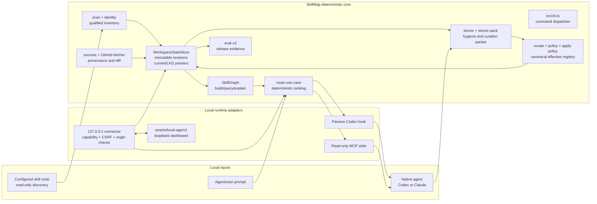
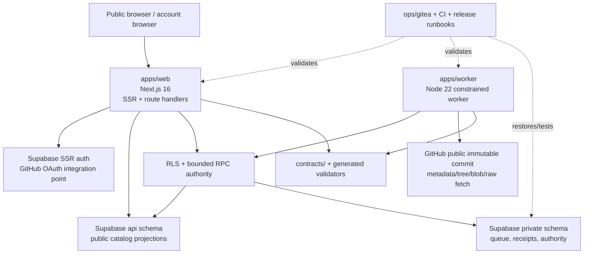
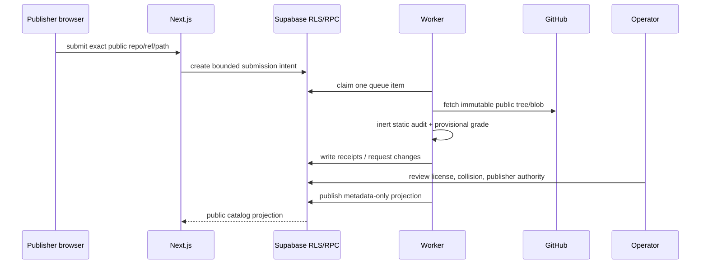

# SkillMap project map and production-readiness review

Focused, editable diagrams are now in [`docs/graphs/README.md`](graphs/README.md). Use those views for architecture, runtime routing, hosted authority, and module dependencies instead of treating this document's overview as one exhaustive graph.

Reviewed: 2026-07-20  
Repository: `/srv/workspaces/projects/skillmap`  
Branch: `codex/hosted-library-foundation`  
HEAD: `c19ca66`  

## Executive status

SkillMap is not one unfinished app. It is a mostly implemented local-first product with a second, separately bounded hosted trust plane.

The local product is the strongest and most complete side: CLI inventory, policy, graph, routing, eval contracts, source provenance, revisions, hook, MCP, and a packaged loopback dashboard are implemented and heavily tested.

The hosted side is a locally implemented alpha candidate: Next.js catalog/account UI, Supabase schema/RLS, submission and report workflows, operator authority, and a constrained worker exist in the tree. It is not production-ready yet because the current branch has no proven remote deployment, live OAuth, scheduled worker, encrypted backup/restore, rollback rehearsal, live monitoring, or real external pilot evidence.

## System graph



## Hosted trust-plane graph



## Main user workflows

### Local routing workflow

```mermaid
sequenceDiagram
  participant U as User or agent
  participant C as CLI / dashboard / MCP / hook
  participant S as WorkspaceStateStore
  participant R as Approved routing state

  U->>C: init roots
  C->>S: persist config and scan inventory
  U->>C: doctor and curate
  C->>S: publish immutable revision
  U->>C: apply-policy
  C->>S: create effective registry and approval receipt
  U->>C: route(prompt)
  C->>R: open current approved or last-known-good state
  R-->>C: deterministic recommendations + trace
  C-->>U: compact route result; prompt is not stored
```

### Hosted submission workflow



## Repository structure

| Area | Responsibility | Current assessment |
|---|---|---|
| `src/cli.ts`, `src/commands/` | CLI surface and mutation boundaries | Implemented |
| `src/core/` | Inventory, identity, policy, graph, route, jobs, revisions, status | Implemented; central product core |
| `src/services/` | Shared route/status/eval/read-model use cases | Implemented and reused by adapters |
| `src/server/` | Local API backend and loopback connector | Implemented; local-only by design |
| `assets/local-app/v1/` | Packaged dashboard static UI | Implemented and browser-tested |
| `apps/web/` | Hosted catalog, account, submission, report, evidence UI/API | Implemented locally; live deployment unproven |
| `apps/worker/` | Service-only audit, queue, publication, lifecycle commands | Implemented locally; scheduling/operations unproven |
| `supabase/migrations/`, `supabase/tests/` | Hosted database schema, RLS, authority, pgTAP | Implemented and locally tested |
| `contracts/`, `src/contracts/generated/` | Versioned cross-surface schemas and validators | Strong; generated parity tested |
| `test/`, `apps/web/tests/` | Unit/integration/privacy/failure/browser/release coverage | Broad; live acceptance remains outside repo-only proof |
| `ops/gitea/`, `.github/`, `.gitea/` | CI, database restore, runner and backup operations | Present; current remote execution must be reverified |
| `catalog/`, `docs/launch/` | First-party skills and initial-corpus launch material | Present; external publisher authority is still gated |

## What is complete

- Local skill discovery with configured roots, qualified identities, duplicate detection, script/risk flags, and fixture boundaries.
- Review-first doctor and doctor-pack flow for native-agent curation.
- Reversible policy application with canonical duplicate decisions, supersedes, exclusions, and effective registry generation.
- Immutable, fsynced workspace revisions with current and last-known-good routing pointers, migration, recovery, rollback, and projection divergence checks.
- Deterministic local route ranking and compact hook output. Routing does not call an LLM or network service.
- SkillGraph build/query/explain/duplicate/conflict/export commands.
- Eval v3 contracts and release-context checks that reject fixture, leakage, untyped, unapproved, or stale evidence.
- Source provenance and bounded GitHub source inspection; personal source update application remains preview-only.
- Passive Codex hook install/uninstall with backup and readiness gates.
- Read-only MCP manifest/call/serve surface.
- Capability-authenticated loopback dashboard with onboarding, workspaces, route lab, policy, evals, sources, trust, activity, integrations, and settings views.
- Redacted snapshots, bounded jobs, cancellation, ETags, origin/CSRF/host checks, and prompt non-persistence in the local connector.
- Hosted public catalog routes, public skill detail/audit/grade projections, free-account saves, exact-commit submissions, reports, export, self-deletion, and release-stage/indexing fail-closed behavior.
- Hosted database migrations, RLS, service-only operator RPCs, receipt contracts, collision review, publisher authorization, lifecycle controls, and constrained inert worker code.
- Extensive local validation: root/web typecheck, contract tests, web boundary tests, fixture/privacy checks, root integration tests, and successful Next.js production build.

## Work remaining before production

### Blocking launch gaps

1. Establish the canonical release commit and reconcile this branch onto the intended `main` lineage. The current branch is ahead of its remote and contains a large hosted-alpha delta; do not treat branch-local validation as a release receipt.
2. Run and retain current CI authority on the exact candidate: Gitea root/web/database lanes and the GitHub hosted-browser lane. Historical CI receipts are not proof for this tree.
3. Provision or explicitly approve the hosted provider path, then deploy the exact commit. Record project ownership, region, plan, environment variables, deployment IDs, and rollback commands.
4. Configure and validate live GitHub OAuth with exact callback/site URLs. The current code has integration points; that is not live auth proof.
5. Run a full disposable hosted acceptance pass against the deployed candidate: anonymous catalog/API, sign-in, save/unsave, submission, withdrawal, reports, export, deletion, RLS isolation, mobile, accessibility, cache policy, and failure paths.
6. Schedule and monitor the worker. Prove claim lease renewal, retry/dead-letter, collision review, publisher authorization, publication, expiry, revocation, and alerting under the deployed database migration head.
7. Prove encrypted backup, restore, replay digest parity, rollback, and recovery from a disposable environment and retain the receipts.
8. Complete publisher consent and corpus gates. Public visibility is not redistribution permission; the initial external corpus must remain blocked until authority is recorded.
9. Run the external pilot and manual acceptance items: keyboard/screen reader, zoom/reflow, forced colors, contrast, real sessions, support/appeal workflow, and abuse/report handling.

### Important product gaps

- Hosted routing/MCP transport, immutable edge index, R2 content, and `load_skill` are not implemented; the hosted catalog is not yet the full online skill-access layer.
- Billing, entitlements, team sync, private-source ingestion, package mirroring/loading, TUF distribution, remote scheduling infrastructure, and current-letter behavioral grading are intentionally deferred.
- Local routing is a linear scan over indexed skill text. It is suitable for the current local scale, but needs an indexed retrieval strategy before a large hosted catalog or tight edge CPU budget.
- The product claim still needs a genuine human/agent A/B evaluation. Existing high-scoring/demo evals are useful directional evidence, not a production efficacy claim.
- The web build emits a `metadataBase` warning; set an explicit production metadata base before launch to avoid environment-dependent social image URLs.

## Recommended path to a production-ready v1

```mermaid
flowchart LR
  A[Freeze exact candidate] --> B[Run current CI authorities]
  B --> C[Provision + deploy private alpha]
  C --> D[Live auth/catalog/account acceptance]
  D --> E[Worker + backup/restore rehearsal]
  E --> F[Publisher-authorized corpus]
  F --> G[Five-seat pilot + manual UX gates]
  G --> H[Review receipts and launch decision]
  H --> I[Public alpha with monitoring and rollback]
```



The practical order is to finish operational proof before adding more product breadth. The local core is already useful; the main risk is not missing UI. It is confusing locally implemented hosted authority with a deployed, recoverable, observable service.

## Evidence run in this review

Validated in the current checkout:

- `npm run typecheck` — passed.
- `npm --prefix apps/web run typecheck` — passed.
- `npm run test:contracts` — passed, 34 tests.
- `npm --prefix apps/web run test:fixtures` — passed, 31 hosted-boundary tests plus fixture/privacy/UI checks.
- `npm --prefix apps/web run lint` — passed.
- `npm --prefix apps/web run build` — passed; Next.js 16.2.10 production build completed. It emitted a `metadataBase` warning.
- `npm run test:integration` — 112 passed, 1 cancelled by the 30-second suite timeout while the recovery test was competing with the other integration cases. The same test passed alone in 10.2 seconds, so this is a suite contention/timeout issue to fix before making the integration lane a release gate.
- `npm test` — passed, 396 tests.
- `npm run test:browser-fixture` — passed, 9 tests across desktop/320px local-app, eval, navigation cancellation, version mismatch, and repair/error states.

Not verified here:

- Remote deployment, live domain, live OAuth, hosted Supabase state, worker schedule, production logs/alerts, backup destination, restore, rollback, public indexing, or real user pilot.

## Source-of-truth files to read next

1. `HANDOFF.md` for release boundary and historical evidence warnings.
2. `docs/architecture.md` and `docs/architecture/hosted-registry.md` for design intent.
3. `docs/operations/free-public-alpha-runbook.md` and `docs/operations/hosted-alpha-deploy.md` for the operational gate sequence.
4. `docs/release-checklist.md` and `docs/ui-acceptance-matrix.md` for release closure.
5. `src/services/workspace-read-model.ts`, `src/services/route-use-case.ts`, and `src/server/skillmap-backend.ts` for the local runtime boundary.
6. `apps/web/lib/registry/`, `apps/web/lib/evidence/`, `apps/worker/src/`, and the latest Supabase migration for hosted authority boundaries.
