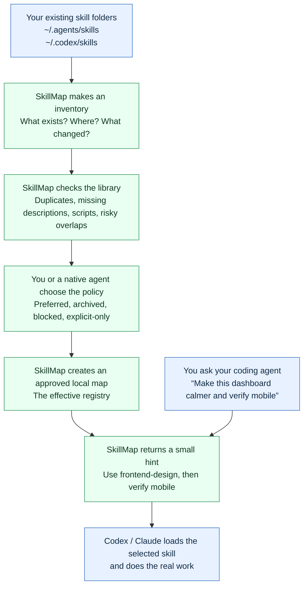
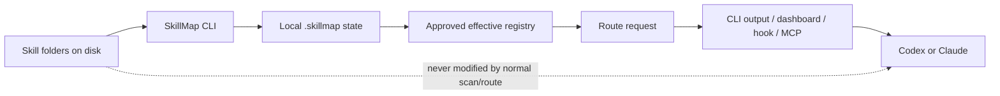
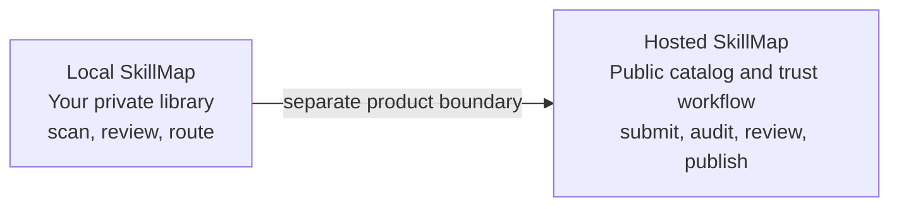

# SkillMap, explained simply

SkillMap is a librarian for the skills your coding agents can use.

It does not replace Codex or Claude. It does not rewrite your skill files. It helps answer one question quickly:

> “Given this request, which of my skills should the agent use?”

## What you get when you use it



That is the whole product in one sentence:

> SkillMap turns a large, messy skill collection into a reviewed local map, then uses that map to give the agent a small, relevant recommendation.

## The five steps

### 1. Inventory: “What do I have?”

You point SkillMap at skill folders. It reads the files and records metadata such as:

- skill name and location;
- description and triggers;
- whether it contains scripts;
- whether two skills look like duplicates;
- whether the files changed.

Your original skill files remain where they are. SkillMap does not execute them during scanning.

Command:

```bash
skillmap scan
```

### 2. Doctor: “What is wrong with my library?”

SkillMap then acts like a code-library checkup. It can tell you:

- “These two skills have the same name.”
- “This skill has no useful description.”
- “This skill contains scripts and should be treated carefully.”
- “This description is so broad that it may match everything.”

Commands:

```bash
skillmap doctor
skillmap status
```

`status` is the safety dashboard. If it says `attention required`, that means SkillMap is refusing to pretend the library is ready.

### 3. Policy: “Which skill should win?”

SkillMap does not automatically guess that a duplicate is safe. You review the choices, often with help from Codex or Claude.

The policy can say:

- use this skill by default;
- use that skill only when explicitly named;
- archive this skill;
- prefer one skill over another;
- never recommend a blocked skill;
- treat a script-bearing skill as higher risk.

Commands:

```bash
skillmap doctor-pack --summary
skillmap curate codex --prepare
skillmap curate codex --ingest POLICY.yml --rationale RATIONALE.md --model MODEL --confirm
skillmap apply-policy --strict
```

After `apply-policy`, SkillMap has an approved “working map.” This is called the effective registry.

### 4. Route: “Which skill matches this request?”

Now you give SkillMap a normal request:

```bash
skillmap route "make this dashboard calmer and verify mobile" --trace
```

It compares the request with the approved registry and returns something like:

```text
Recommended: frontend-design
Reason: preferred intent match, name-token match
Excluded: unrelated skills, archived skills, explicit-only skills
```

The route is deterministic and local. It does not call an AI model for every prompt. That keeps it fast, private, and predictable.

### 5. Agent work: “What does Codex or Claude actually receive?”

SkillMap does not do the coding work itself.

The agent still receives the user’s request and then receives a compact hint about the relevant skill. The agent can load or use that skill when needed instead of being surrounded by a huge, noisy skill collection.

Optional integrations:

- `hook`: gives Codex a passive route hint when a prompt arrives;
- `mcp`: lets an agent query SkillMap explicitly;
- `dashboard`: gives you a local visual control panel.

## What SkillMap does not do

This is important:

- It does not replace the coding agent.
- It does not edit or delete your skill files.
- It does not execute skill scripts during normal routing.
- It does not send every prompt to a cloud model.
- It does not automatically install a global hook.
- It does not prove that a hosted website or worker is deployed.

## What happens inside the computer



The `.skillmap` folder is SkillMap’s local memory. It holds inventories, policy, revisions, status, route evidence, and recovery information. The current design keeps changes revisioned so it can detect stale or unsafe state instead of silently using it.

## The optional hosted part

There are really two products in this repository:



The hosted side lets people submit public GitHub-based skills, lets a worker inspect them without executing their scripts, and lets operators publish bounded metadata and evidence.

You do not need the hosted side to use SkillMap locally. The local CLI/router is the core product.

## A concrete example

Imagine you have these skills:

```text
frontend-design
better-ui
react-best-practices
debugging
```

You ask:

```text
Make this dashboard less generic and verify mobile behavior.
```

Without SkillMap, the agent may see several overlapping choices.

With SkillMap:

1. SkillMap sees `dashboard`, `generic`, and `mobile` intent.
2. Your policy says `frontend-design` is preferred for visual/product work.
3. `react-best-practices` may be included if the task needs React implementation details.
4. Unrelated or explicit-only skills are excluded.
5. Codex receives a compact recommendation and performs the implementation.

The value is not that SkillMap magically makes the agent smarter. The value is that it makes the agent’s skill choices more deliberate, smaller, and easier to inspect.

## Current reality

The local side is implemented and heavily tested. The hosted side is locally implemented but is still an alpha candidate: live deployment, OAuth, worker scheduling, backups, rollback, and external pilot behavior still need separate proof.

For a first real use, follow this order:

```text
init → scan → status → doctor → doctor-pack → curate → apply-policy → route → optional hook/MCP
```
